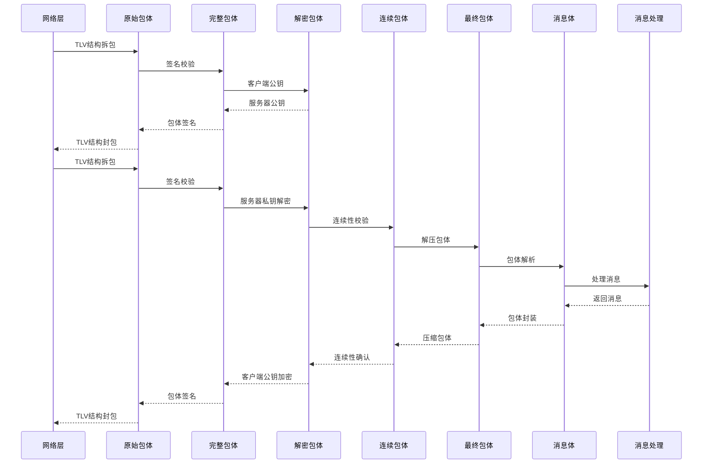

# 解析策略

解析策略共包含两部分：

* 网络适配器，适配不同的网络框架，如果条件可以，尽量使用zero copy的原则。
* 包体解析，包体中包含消息号和消息体，需要从包体中解析出来消息号和消息体，便于后续消息的处理。

消息处理流程：

```mermaid
sequenceDiagram
网络层 ->> 原始包体:TLV结构拆包
原始包体 ->> 完整包体:签名校验
完整包体 ->> 解密包体:客户端公钥
解密包体 -->> 完整包体:服务器公钥
完整包体 -->> 原始包体:包体签名
原始包体 -->> 网络层:TLV结构封包
网络层 ->> 原始包体:TLV结构拆包
原始包体 ->> 完整包体:签名校验
完整包体 ->> 解密包体:服务器私钥解密
解密包体 ->> 连续包体:连续性校验
连续包体 ->> 最终包体:解压包体
最终包体 ->> 消息体:包体解析
消息体 ->> 消息处理:处理消息
消息处理 -->> 消息体:返回消息
消息体 -->> 最终包体:包体封装
最终包体 -->> 连续包体:压缩包体
连续包体 -->> 解密包体:连续性确认
解密包体 -->> 完整包体:客户端公钥加密
完整包体 -->> 原始包体:包体签名
原始包体 -->> 网络层:TLV结构封包
```