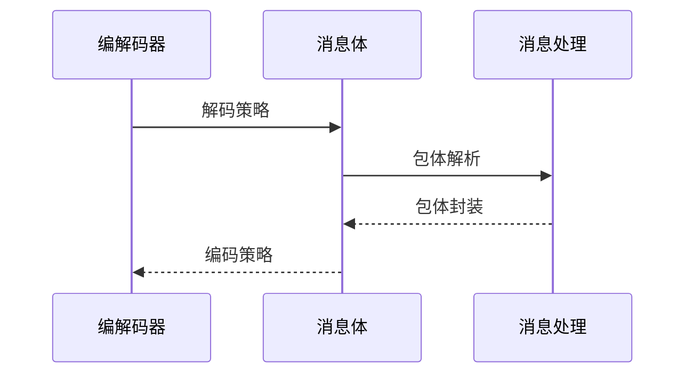

# 解析策略

解析策略共包含两部分：

* 消息解析，负责将包体封装成一个指定的数据结构，便于消息的处理。
* 包体解析，包体中包含消息号和消息体，需要从包体中解析出来消息号和消息体，便于后续消息的处理。

消息处理流程：

```mermaid
sequenceDiagram
编解码器 ->> 消息体:解码策略
消息体 ->> 消息处理:包体解析
消息处理 -->> 消息体:包体封装
消息体 -->> 编解码器:编码策略
```